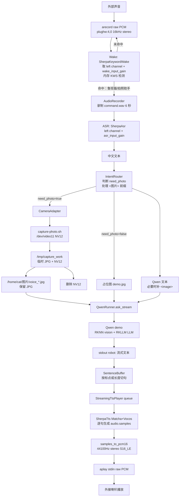
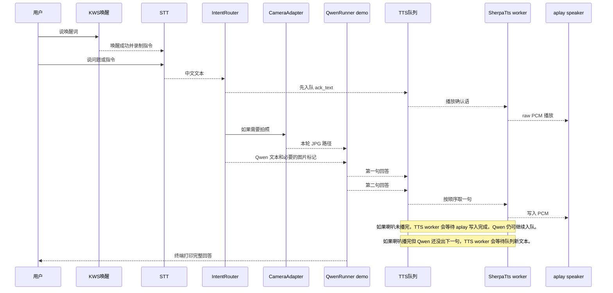

# 本地中文语音拍照 Qwen-VL 助手

这是一个运行在 LubanCat 本机上的中文语音视觉助手。它可以常驻监听唤醒词，在听到“鲁班猫”或“拍照助手”后录制一段中文指令，按需调用摄像头拍照，把语音文本和可选图片交给本地 Qwen3-VL RKNN/RKLLM demo，再把模型回答按句流式合成为语音，通过外接喇叭播放。

整个链路默认完全本地运行，不依赖云端 STT、TTS 或大模型 API。

## 项目基座

本项目面向 RK3588 平台运行，当前部署在 LubanCat 本机环境中，核心推理依赖板端 NPU/RKNN/RKLLM 运行时和本地 sherpa-onnx 语音模型。

当前基于的主要模型和运行资产：

- Qwen3-VL 视觉模型：`qwen3-vl-2b_vision_rk3588.rknn`
- Qwen3-VL 语言模型：`qwen3-vl-2b-instruct_w8a8_rk3588.rkllm`
- RKNN runtime：`librknnrt.so`
- RKLLM runtime：`librkllmrt.so`
- 中文唤醒词 KWS：`models/sherpa-onnx-kws-zipformer-zh-en-3M-2025-12-20/`
- 中文语音识别 STT：`models/sherpa-onnx-conformer-zh-stateless2-2023-05-23/`
- 中文语音合成 TTS 声学模型：`models/matcha-icefall-zh-baker/model-steps-3.onnx`
- TTS 声码器：`models/vocos-22khz-univ.onnx`

## 公开仓库说明

为了避免 GitHub 普通仓库的大文件限制，也避免公开分发模型和板端 runtime 的许可证风险，本仓库只提交代码、脚本、配置、文档和小型占位图，不提交以下本地资产：

- `.venv/` 虚拟环境
- `__pycache__/`、`*.pyc` 等 Python 运行缓存
- `models/` 下的 KWS、STT、TTS、Vocos 模型文件
- `qwen3-vl-2b_vision_rk3588.rknn`
- `qwen3-vl-2b-instruct_w8a8_rk3588.rkllm`
- `librknnrt.so`
- `librkllmrt.so`
- `demo`
- `imgenc`
- `.wav`、`.pcm`、`.raw` 等临时音频文件
- `.nv12`、`.yuv` 等相机原始帧或中间帧
- `.mp4`、`.log` 等调试输出
- `.agents/`、`.codex/` 等本地工具元数据
- `.DS_Store`、`*.swp`、`*.swo` 等系统或编辑器临时文件

这些排除规则写在 [.gitignore](/home/cat/ai/qwen3vl2b/.gitignore) 中。它们不会影响本机运行；只是避免把可重新生成的缓存、带隐私风险的临时音频/图片中间文件、大模型和第三方 runtime 推送到公开仓库。

克隆公开仓库后，需要在项目根目录手动放回这些文件，并保持 [config/default.yaml](/home/cat/ai/qwen3vl2b/config/default.yaml) 中的路径一致。Python 虚拟环境通过 `requirements.txt` 复现：

```bash
python3 -m venv .venv
. .venv/bin/activate
pip install -r requirements.txt
```

需要手动准备的本地模型和运行资产路径：

```text
/home/cat/ai/qwen3vl2b/demo
/home/cat/ai/qwen3vl2b/imgenc
/home/cat/ai/qwen3vl2b/librknnrt.so
/home/cat/ai/qwen3vl2b/librkllmrt.so
/home/cat/ai/qwen3vl2b/qwen3-vl-2b_vision_rk3588.rknn
/home/cat/ai/qwen3vl2b/qwen3-vl-2b-instruct_w8a8_rk3588.rkllm
/home/cat/ai/qwen3vl2b/models/sherpa-onnx-kws-zipformer-zh-en-3M-2025-12-20/
/home/cat/ai/qwen3vl2b/models/sherpa-onnx-conformer-zh-stateless2-2023-05-23/
/home/cat/ai/qwen3vl2b/models/matcha-icefall-zh-baker/
/home/cat/ai/qwen3vl2b/models/vocos-22khz-univ.onnx
```

## 许可证

本仓库中的代码、脚本和文档使用 [MIT License](/home/cat/ai/qwen3vl2b/LICENSE)。

MIT License 允许他人在保留版权声明和许可证文本的前提下使用、复制、修改、分发和商用本仓库内容。该授权不代表他人可以直接修改本仓库；外部贡献仍需要通过 fork、branch 或 pull request，由仓库维护者决定是否合并。

本许可证不覆盖未提交到仓库的第三方模型、RKNN/RKLLM runtime、demo 二进制、语音模型文件或其它第三方资产。这些资产应遵循各自来源的许可证和使用条款。

## 本地运行优势

- **隐私更强**：唤醒、语音识别、图片、问题文本、模型回答和语音合成都在本机处理，不上传语音、照片或对话内容。
- **离线可用**：不依赖公网、云服务账号、API key 或远端服务稳定性。
- **延迟可控**：唤醒词、ASR、Qwen 推理、TTS 和播放都在本机路径内，延迟主要由板端算力和模型大小决定。
- **成本固定**：没有云端按量计费，适合长时间常驻监听和反复测试。
- **数据落盘可控**：无效录音不保存；回答 TTS 不生成音频文件；临时指令音频和拍照中间文件放在 `/tmp/qwen_voice_assistant`，用完删除。
- **硬件路径透明**：麦克风、摄像头、Qwen demo、TTS、外接喇叭都由本项目内的配置和脚本串起来，便于定位问题。

## 快速使用

单次唤醒问答：

```bash
./scripts/run_listen.sh kws 6
```

常驻唤醒问答：

```bash
./scripts/run_listen_forever.sh kws 6
```

唤醒词：

```text
鲁班猫
拍照助手
```

唤醒后会录制 6 秒指令。比如：

```text
帮我看看眼前有什么
请拍照看看图片里有什么
这是什么东西
请介绍一下你自己
```

单独测试流式 TTS 到外接喇叭：

```bash
.venv/bin/python voice_assistant.py tts-stream "这是流式内存播放测试。"
```

手动清理临时目录：

```bash
.venv/bin/python voice_assistant.py cleanup
```

## 当前关键配置

配置文件：[config/default.yaml](/home/cat/ai/qwen3vl2b/config/default.yaml)

```yaml
paths:
  temp_dir: /tmp/qwen_voice_assistant
  photo_dir: /home/cat/图片
  placeholder_image: /home/cat/ai/qwen3vl2b/demo.jpg
  capture_script: /home/cat/ai/qwen3vl2b/scripts/capture-photo.sh

audio:
  mic_device: plughw:4,0
  speaker_device: plughw:4,0
  sample_rate: 16000
  channels: 2
  input_channel: left
  capture_channel_gain: 8
  wake_input_gain: 8.0
  asr_input_gain: 5.0
  playback_sample_rate: 44100
  playback_channels: 2

qwen:
  max_new_tokens: 2048
  max_context_len: 4096

models:
  tts:
    ack_text: 好的，我先思考一下。
    stream_max_speak_chars: 220
```

说明：

- `max_new_tokens: 2048` 是单次 Qwen 最大新生成 token 数。
- `max_context_len: 4096` 是传给 Qwen demo 的上下文窗口配置。
- `placeholder_image` 用于不拍照的问题，因为当前 `demo` 启动参数强依赖 `image_path`。
- `capture_channel_gain: 8` 是 ES8388 采集硬件增益上限。
- `wake_input_gain` 和 `asr_input_gain` 是软件输入增益。
- 回答播报只走流式 PCM，不再生成 `answer.wav`。

## 模块职责

### 1. 唤醒词检测

实现文件：[voice_assistant/wake.py](/home/cat/ai/qwen3vl2b/voice_assistant/wake.py)

默认使用 `SherpaKeywordWake`：

- 通过 `arecord -D plughw:4,0 -f S16_LE -r 16000 -c 2 -t raw` 从麦克风读取 raw PCM。
- 不把唤醒阶段音频写成 WAV 文件。
- 只取左声道，因为当前麦克风声音主要在左声道。
- 对输入应用 `wake_input_gain` 软件增益。
- 用 `sherpa-onnx` KWS 模型检测 `config/wake_keywords.txt` 中的唤醒词。

备用 `SttKeywordWake`：

- 用短音频 chunk 做 STT 关键词检测。
- 会短暂生成 `/tmp/qwen_voice_assistant/wake_chunk_*.wav`。
- 每个 chunk 都在 `finally` 中删除。

### 2. 录音与麦克风增益

实现文件：[voice_assistant/audio_io.py](/home/cat/ai/qwen3vl2b/voice_assistant/audio_io.py)

`AudioRecorder` 只在唤醒后录制有效指令：

```text
/tmp/qwen_voice_assistant/command.wav
```

录音前会调用 `apply_mic_mixer_settings()`：

- 设置 ES8388 `Left Channel` 和 `Right Channel` 到 `capture_channel_gain`。
- 当前为 `8/8`，也就是硬件采集增益最大。

录音文件在 STT 后删除；录音过程中如果中断，也会删除半截文件。

### 3. 中文 STT

实现文件：[voice_assistant/asr.py](/home/cat/ai/qwen3vl2b/voice_assistant/asr.py)

`SherpaAsr` 使用本地 `sherpa-onnx` 中文 Conformer 模型：

- 读取 `command.wav`
- 选择左声道
- 应用 `asr_input_gain`
- 调用 `OfflineRecognizer.from_transducer(...)`
- 输出中文文本

### 4. 意图解析

实现文件：[voice_assistant/intent.py](/home/cat/ai/qwen3vl2b/voice_assistant/intent.py)

`IntentRouter` 是纯 Python 规则模块，不额外调用模型。

它负责：

- 判断是否需要拍照：匹配 `config/default.yaml` 里的 `intent.photo_keywords`
- 如果文本包含 `图片`，在传给 Qwen 前加 `<图片>`

示例：

```text
帮我看看眼前有什么 -> need_photo = true
这是什么东西 -> need_photo = true
请介绍一下你自己 -> need_photo = false
这张图片里有什么 -> qwen_text = <图片>这张图片里有什么
```

### 5. 摄像头拍照

实现文件：

- [voice_assistant/camera.py](/home/cat/ai/qwen3vl2b/voice_assistant/camera.py)
- [scripts/capture-photo.sh](/home/cat/ai/qwen3vl2b/scripts/capture-photo.sh)

`CameraAdapter` 不直接操作 V4L2，而是调用本项目内脚本：

```bash
/home/cat/ai/qwen3vl2b/scripts/capture-photo.sh
```

拍照路径：

```text
/tmp/qwen_voice_assistant/capture_work/voice_*.nv12
/tmp/qwen_voice_assistant/capture_work/voice_*.jpg
```

然后：

- JPG 移动到 `/home/cat/图片/voice_*.jpg`
- `.nv12` 原始帧删除
- 最终 JPG 路径作为 Qwen 图片输入

当前相机默认参数：

```text
device: /dev/video11
width: 1920
height: 1080
pixfmt: NV12
skip: 30
```

### 6. Qwen RKNN/RKLLM 交互

实现文件：[voice_assistant/qwen_runner.py](/home/cat/ai/qwen3vl2b/voice_assistant/qwen_runner.py)

`QwenRunner` 用 `pexpect` 驱动当前目录下的交互式 `demo`：

```text
./demo image_path vision_model llm_model max_new_tokens max_context_len rknn_core_num img_start img_end img_content
```

实际参数来自配置：

```text
image_path: 本轮拍照 JPG 或 demo.jpg 占位图
vision_model: qwen3-vl-2b_vision_rk3588.rknn
llm_model: qwen3-vl-2b-instruct_w8a8_rk3588.rkllm
max_new_tokens: 2048
max_context_len: 4096
rknn_core_num: 3
```

当前实现有两个问答方法：

- `ask(...)`：等待完整回答，主要作为无播放/测试路径。
- `ask_stream(...)`：读取 `robot:` 后的 stdout，按句切分并回调给 TTS 播放队列。

因为当前 `demo` 的图片路径是启动参数，所以每轮都会按本轮图片路径启动一次 demo。

视觉标记规则：

- 用户文本包含 `图片` 时，先加 `<图片>`
- 如果本轮使用图片，发送给 demo 前再补 `<image>`
- 这是为了同时保留用户规则和当前 demo 的实际视觉触发要求

### 7. 流式 TTS 与内存 PCM 播放

实现文件：

- [voice_assistant/streaming_tts.py](/home/cat/ai/qwen3vl2b/voice_assistant/streaming_tts.py)
- [voice_assistant/tts.py](/home/cat/ai/qwen3vl2b/voice_assistant/tts.py)
- [voice_assistant/audio_utils.py](/home/cat/ai/qwen3vl2b/voice_assistant/audio_utils.py)
- [voice_assistant/audio_io.py](/home/cat/ai/qwen3vl2b/voice_assistant/audio_io.py)

当前回答播报只有流式 PCM 路径：

```text
Qwen 生成一句文本
-> StreamingTtsPlayer.enqueue(text)
-> queue.Queue 排队
-> 后台 TTS 线程取一句
-> SherpaTts.synthesize_samples(text)
-> 得到内存里的 audio.samples
-> samples_to_pcm16(...)
-> 44100Hz 双声道 S16_LE PCM bytes
-> 写入 aplay stdin
-> 外接喇叭播放
```

没有 `answer.wav`，也没有 `*_playback.wav`。

`SherpaTts` 使用本地 Matcha Baker 中文模型和 Vocos 声码器：

```text
models/matcha-icefall-zh-baker/model-steps-3.onnx
models/vocos-22khz-univ.onnx
```

注意：TTS 模型本身是 offline TTS，不是 token 级 TTS。当前流式是“Qwen 输出层按句流式 + 每句独立 TTS + PCM 管道播放”。

### 8. 确认播报

配置：

```yaml
models:
  tts:
    ack_text: 好的，我先思考一下。
```

唤醒并识别出用户指令后，会先把这句确认文本放进 TTS 队列，同时继续拍照和调用 Qwen。这样用户能立即听到反馈，不用等 Qwen 首句输出。

### 9. 常驻编排

实现文件：

- [voice_assistant/orchestrator.py](/home/cat/ai/qwen3vl2b/voice_assistant/orchestrator.py)
- [voice_assistant/cli.py](/home/cat/ai/qwen3vl2b/voice_assistant/cli.py)

`VoiceAssistant.listen_forever()` 是常驻循环：

```text
等待唤醒
-> 处理一轮
-> 打印完整回答
-> 清理临时文件
-> 回到等待唤醒
```

单轮失败时会打印错误并继续下一轮。`Ctrl+C` 退出。

## 流程图

### 总体数据流



### 时序与通信排队



### 文本与图片传播路径

```text
语音路径：
  麦克风 raw PCM
    -> KWS 内存检测
    -> command.wav
    -> STT 中文文本
    -> IntentRouter
    -> Qwen 文本
    -> Qwen stdout 流式文本
    -> 句子队列
    -> TTS samples
    -> PCM bytes
    -> aplay stdin
    -> 外接喇叭

图片路径：
  need_photo=false:
    demo.jpg 占位图
      -> Qwen demo image_path

  need_photo=true:
    /dev/video11
      -> /tmp/qwen_voice_assistant/capture_work/voice_*.nv12
      -> /tmp/qwen_voice_assistant/capture_work/voice_*.jpg
      -> /home/cat/图片/voice_*.jpg
      -> Qwen demo image_path
    其中 .nv12 会删除，JPG 保留。

排队路径：
  QwenRunner 负责生产句子
    -> StreamingTtsPlayer 的 queue.Queue
    -> TTS worker 单线程顺序消费
    -> PcmSpeakerStream 顺序写入 aplay stdin
```

## 临时文件策略

默认目录：

```text
/tmp/qwen_voice_assistant
```

当前策略：

- 唤醒阶段 KWS 不保存无效录音。
- 唤醒后只保存本轮有效指令为 `command.wav`，STT 后删除。
- STT fallback 模式的 `wake_chunk_*.wav` 会在每个 chunk 后删除。
- 回答 TTS 不落盘，只在内存中生成 samples 和 PCM bytes。
- 拍照时 `.nv12` 原始帧生成在 `/tmp`，转换后删除。
- 拍照 JPG 最终保存在 `/home/cat/图片`，这是有意保留的用户照片。
- Qwen 回答文本不保存日志，只打印到终端。

检查临时文件：

```bash
find /tmp/qwen_voice_assistant -maxdepth 3 -type f -ls 2>/dev/null
```

没有输出表示没有残留文件。

## 文件树

```text
/home/cat/ai/qwen3vl2b
├── readme.md
│   └── 当前项目级说明文档。
├── README_voice_assistant.md
│   └── 早期测试说明，保留常用测试命令。
├── todo.md
│   └── 实现计划、决策记录和已完成阶段。
├── .venv/
│   ├── bin/
│   │   ├── python
│   │   │   └── 本项目虚拟环境 Python 入口。
│   │   ├── pip
│   │   │   └── 虚拟环境 pip。
│   │   └── sherpa-onnx-cli
│   │       └── sherpa-onnx 安装后提供的命令行工具。
│   └── lib/python3.12/site-packages/
│       ├── sherpa_onnx/
│       │   └── sherpa-onnx Python 包，KWS/STT/TTS 都通过它调用。
│       ├── sherpa_onnx.libs/
│       │   └── sherpa-onnx 依赖的本地动态库。
│       ├── sherpa_onnx-1.13.2.dist-info/
│       │   └── sherpa-onnx 包元数据。
│       ├── sherpa_onnx_core-1.13.2.dist-info/
│       │   └── sherpa-onnx core 包元数据。
│       ├── pexpect/
│       │   └── QwenRunner 用它驱动交互式 demo 的 stdin/stdout。
│       ├── ptyprocess/
│       │   └── pexpect 的 PTY 子进程依赖。
│       ├── yaml/
│       │   └── PyYAML，config.py 用它读取 default.yaml。
│       └── numpy/
│           └── 音频样本处理、声道选择、增益、重采样和 PCM 转换。
├── config/
│   ├── default.yaml
│   │   └── 总配置：路径、音频设备、模型路径、KWS阈值、Qwen参数、拍照意图词。
│   └── wake_keywords.txt
│       └── sherpa-onnx KWS 唤醒词，当前为“鲁班猫”和“拍照助手”。
├── voice_assistant.py
│   └── Python CLI 入口，调用 voice_assistant.cli.main()。
├── voice_assistant/
│   ├── __init__.py
│   │   └── Python package 标记。
│   ├── cli.py
│   │   └── 命令行子命令：record、stt、tts-stream、camera、wake、ask、listen、listen-forever、cleanup。
│   ├── config.py
│   │   └── 加载 YAML 配置。
│   ├── orchestrator.py
│   │   └── 总编排：唤醒、录音、STT、意图、拍照、Qwen、流式 TTS、常驻循环。
│   ├── wake.py
│   │   └── KWS 唤醒和 STT fallback 唤醒。
│   ├── asr.py
│   │   └── sherpa-onnx 中文 STT。
│   ├── intent.py
│   │   └── 规则意图识别：是否拍照、是否加 <图片>。
│   ├── camera.py
│   │   └── CameraAdapter，调用本项目 capture-photo.sh，移动 JPG，删除 NV12。
│   ├── qwen_runner.py
│   │   └── pexpect 驱动 Qwen demo，支持完整回答和流式按句回调。
│   ├── tts.py
│   │   └── SherpaTts，加载 Matcha+Vocos，本地生成 audio.samples。
│   ├── streaming_tts.py
│   │   └── StreamingTtsPlayer，队列化逐句 TTS 和播放。
│   ├── audio_io.py
│   │   └── 录音、麦克风 mixer 设置、raw PCM 管道播放。
│   ├── audio_utils.py
│   │   └── WAV读取、声道选择、输入增益、重采样、samples到PCM转换。
│   └── text_clean.py
│       └── 清洗 Qwen 输出，过滤 Markdown、日志碎片、OOV符号，避免无效 TTS。
├── scripts/
│   ├── capture-photo.sh
│   │   └── 本地相机拍照脚本，/dev/video11 NV12 -> JPG。
│   ├── run_listen.sh
│   │   └── 单次唤醒问答入口。
│   ├── run_listen_forever.sh
│   │   └── 常驻唤醒问答入口。
│   ├── test_camera.sh
│   │   └── 单独测试拍照。
│   ├── test_once_voice.sh
│   │   └── 单独测试录音到完整问答，不先等唤醒。
│   ├── test_qwen_text.sh
│   │   └── 文本直接问 Qwen。
│   ├── test_stt_record.sh
│   │   └── 录一段中文并做 STT。
│   ├── test_tts_play.sh
│   │   └── 流式 TTS 到外接喇叭。
│   └── test_wake_record.sh
│       └── 录一段唤醒词，分别测试 KWS 和 STT。
├── models/
│   ├── sherpa-onnx-conformer-zh-stateless2-2023-05-23/
│   │   └── 中文 STT 模型文件；运行库不在这里，在 .venv 的 sherpa_onnx 包里。
│   ├── sherpa-onnx-kws-zipformer-zh-en-3M-2025-12-20/
│   │   └── KWS 唤醒词模型文件。
│   ├── matcha-icefall-zh-baker/
│   │   └── 中文 Matcha TTS 声学模型和词典文件。
│   └── vocos-22khz-univ.onnx
│       └── TTS 声码器模型文件。
├── demo
│   └── Qwen3-VL RKNN/RKLLM 交互式 demo 二进制。
├── imgenc
│   └── Qwen 视觉编码相关二进制。
├── qwen3-vl-2b_vision_rk3588.rknn
│   └── 视觉 RKNN 模型。
├── qwen3-vl-2b-instruct_w8a8_rk3588.rkllm
│   └── LLM RKLLM 模型。
├── librknnrt.so
│   └── RKNN runtime 动态库。
├── librkllmrt.so
│   └── RKLLM runtime 动态库。
├── demo.jpg
│   └── 不拍照时传给 demo 的占位图。
├── run_qwen3vl.sh
│   └── 原始 demo 启动脚本，当前主流程由 QwenRunner 直接调用 demo。
├── camera_status.md
│   └── 摄像头配置和验证记录。
├── onboard_mic_status.md
│   └── 板载麦克风配置和验证记录。
└── speaker_status.md
    └── 外接喇叭模块配置和验证记录。
```

## 常用诊断命令

查看 CLI 帮助：

```bash
.venv/bin/python voice_assistant.py --help
```

单独测试唤醒词：

```bash
./scripts/test_wake_record.sh 3
```

单独测试 STT：

```bash
./scripts/test_stt_record.sh 5
```

单独测试拍照：

```bash
./scripts/test_camera.sh
```

单独测试流式 TTS：

```bash
./scripts/test_tts_play.sh "你好，我是本地中文语音助手。"
```

文本直接问 Qwen，不播报：

```bash
.venv/bin/python voice_assistant.py ask "这张图片里有什么？" --image demo.jpg --no-speak --no-play
```

## 运行边界

- 当前没有做 `systemd service`，常驻模式是前台 Python 进程。
- 唤醒后指令录音仍是固定秒数，默认 6 秒；还没有做 VAD 自动断句。
- 常驻 KWS 模式不保存无效录音。
- 如果进程被 `kill -9` 或设备断电，程序无法执行清理逻辑；可下次启动前手动运行 `cleanup`。
- 流式 TTS 是句子级流式，不是 TTS 模型内部 token 级流式。
